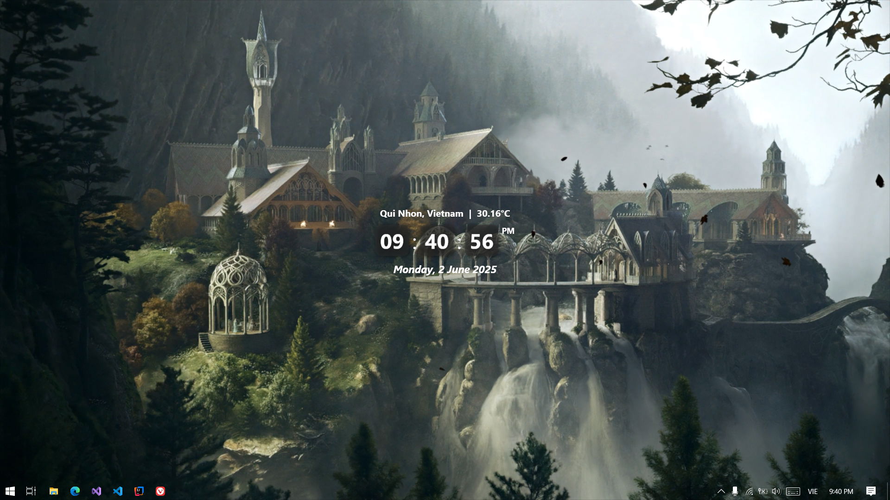

# Desktop Clock

A modern, elegant desktop clock application built with WPF that displays accurate time, date, weather information, and location.



## Features

- 🕒 Real-time clock with seconds display
- 📅 Full date display with day name
- 🌡️ Current weather information
- 📍 Location detection
- 🎯 Always-on-top window
- 🎨 Modern, transparent UI design
- 🔄 Automatic time synchronization with world time server
- 🌐 Weather updates from OpenWeatherMap API

## Requirements

- Windows 10 or later
- .NET 8.0 Runtime
- Internet connection for weather and time synchronization

## Auto-start Setup

To make the clock appear automatically when you start your computer:

1. Make sure you have .NET 8.0 Runtime installed on your computer
2. Clone the repository to your computer.
3. Open `Desktop_Clock.exe` to see the clock appear.
4. If it's working fine, right-click `Desktop_Clock.exe` and select 'Create shortcut'.
5. Move the shortcut into the startup folder (`C:\Users\<user name>\AppData\Roaming\Microsoft\Windows\Start Menu\Programs\Startup`).
6. Done! The clock will now appear anytime you start your computer.

## Configuration

The application requires an OpenWeatherMap API key for weather functionality:

1. Sign up for a free API key at [OpenWeatherMap](https://openweathermap.org/api)
2. Add your API key to the `App.config` file:

```xml
<configuration>
  <appSettings>
    <add key="OpenWeatherApiKey" value="YOUR_API_KEY_HERE" />
  </appSettings>
</configuration>
```

## Features in Detail

### Time Display

- 24-hour format
- Automatic synchronization with world time server
- Updates every second
- Displays hours, minutes, and seconds

### Weather Information

- Shows current temperature
- Displays city and country
- Updates every hour
- Uses OpenWeatherMap API for accurate weather data

### Location Detection

- Automatically detects your location using IP geolocation
- Updates weather information based on your location
- No manual configuration needed

### UI Features

- Transparent background
- Modern, clean design
- Always visible on desktop
- Non-intrusive (hides from Alt+Tab and taskbar)

## Technical Details

- Built with WPF (.NET 8.0)
- Uses WorldTimeAPI for time synchronization
- Implements OpenWeatherMap API for weather data
- Uses IP-API for location detection

## Error Handling

The application includes robust error handling:

- Automatic retry for failed API connections
- Fallback to local time if time server is unavailable
- Clear error messages for network issues

## Contributing

Feel free to submit issues and enhancement requests!

## License

This project is licensed under the MIT License - see the LICENSE file for details.
